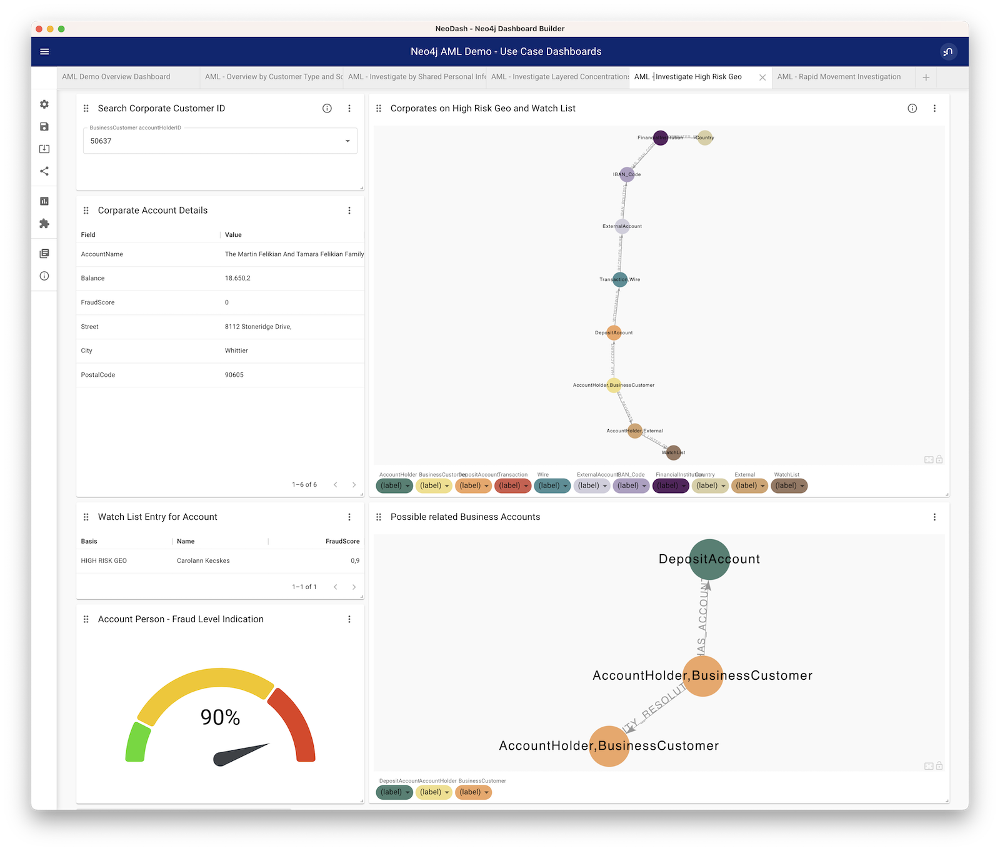

# Example Dashboard for the Neo4j AML & Fraud Framework Demo (work in progress)

These Dashboards for the Neo4j AML & Fraud Demo are meant, to add to the existing Demo in Hive. The file '''aml-dashboard_v2.json''' in the dashboards directory can be used to import it into NeoDash. Then connect to the AML Demo on Hive using the credentials provided in the demo script. Refer to the NeoDash Documentation for help. You can find it here: [NeoDash Documentation Link](https://neo4j.com/labs/neodash/2.1/user-guide/)

The Dashboard is structured in the following way:

### Demo Overview Dashboard

This is aimed to be used as a starting point explaining the data, architecture and data model behind the demo.

### Consumer Scenario Dashboard

This is similar to the Scenario Overview in the Demo Application and show results in two different visualizations. A table with field formating and a radar chart. Two different visualizations used, to demonstrate different ways of visualizations.

### Shared Personal Identifiable Information (PII)

This dashboard illustrates the PII demo workflow that can be use with the demo application. Clicking on the "i" in the upper left of the parameter select visualizations shows and explanation and also AccountIDs that will provide a reasonable output for the visualizations! The **same** is true for other parameter select visualizations in the dashboards below.

### Layered Concentration Dashboard

This dashboard is also aimed to show data from a workflow done with the demo application. Same applies to the following dashboards.

### High Risk Geo Dashboard

### Rapid Movement of Funds Dashboard

This is a first version of the dashboards and will get improvements in the coming month.
